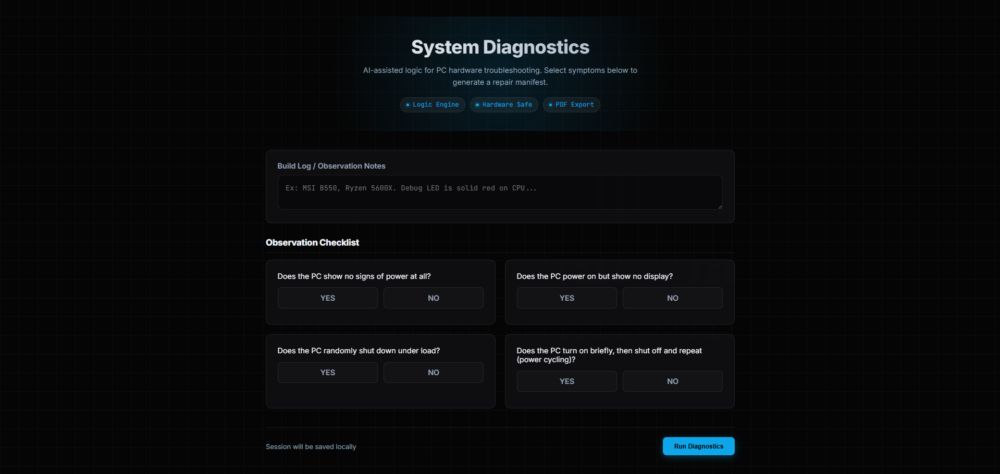
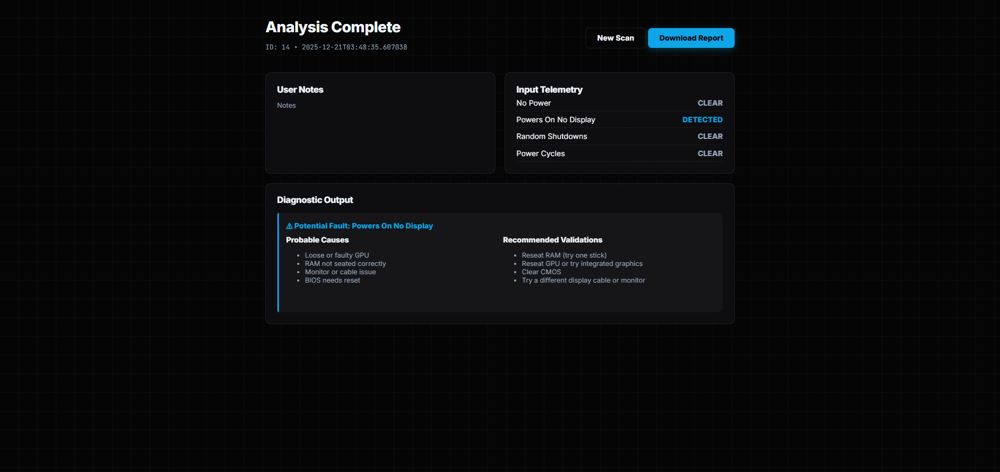

# PC Builder Troubleshooter

A full-stack diagnostic tool that helps troubleshoot common PC build issues such as **no power**, **no display**, and **random shutdowns**.
Users answer symptom-based questions and receive **probable causes**, **recommended next tests**, and a **shareable PDF report**.

Built to combine **hardware domain knowledge** with **clean software design**.

## Why This Project

Building and troubleshooting PCs often relies on informal advice and guesswork.
This project formalizes common troubleshooting knowledge into a structured,
repeatable diagnostic process that produces clear next steps and documentation.

## Features

- **Rule-based diagnostic engine**
  Matches user-reported symptoms to likely hardware causes and next troubleshooting steps.

- **Persistent session logging (SQLite)**
  Every diagnostic run is saved for later review or report generation.

- **Automatic PDF report generation**
  Create a professional, shareable diagnostic report per session.

- **CLI interface**
  Run diagnostics directly from the terminal with optional PDF generation.

- **Immersive Web UI (FastAPI)**
  A responsive, "Glassmorphism" interface featuring:
  - **Void Black** aesthetic with digital grid backgrounds.
  - **Neon accents** and glowing active states for inputs.
  - **Glass-panel cards** with blur effects for a modern, dashboard feel.

## Screenshots

### Web Interface
The new UI features a "Void Black" aesthetic with glass-morphism panels and neon accents.


*The main diagnostic form featuring glowing inputs and a digital grid background.*


*The results view showing structured diagnostic outputs in dark mode.*

## Tech Stack

**Backend**
- Python 3
- FastAPI
- SQLite
- ReportLab (PDF generation)

**Frontend**
- HTML
- CSS (Custom CSS Variables, Flexbox/Grid, Glassmorphism effects)
- Fonts (Inter & JetBrains Mono)
- No frontend frameworks (intentionally lightweight)

**Other**
- Rule-based decision logic
- Modular project structure
- CLI + Web entry points

## Getting Started

### Clone the repository
```bash
git clone https://github.com/sleepyhugo/pc-builder-troubleshooter.git
cd pc-builder-troubleshooter
```

### Create a virtual environment
```bash
python -m venv .venv
source .venv/bin/activate   # Windows: .venv\Scripts\activate
```

### Install dependencies
```bash
pip install -r requirements.txt
```

## Running the CLI
```bash
python -m app.cli
```

From the menu you can:
- Run a new diagnostic
- View recent sessions
- Generate PDF reports for past sessions


## Running the Web App
```bash
uvicorn app.web.web_app:app --reload
```

Open in your browser:
```
http://127.0.0.1:8000
```

Features:
- Answer symptom questions
- View diagnostic results
- Download PDF report per session